---

copyright:
  years: 2015, 2016
lastupdated: "2016-12-19"

---

{:new_window: target="_blank"}
{:shortdesc: .shortdesc}
{:screen: .screen}
{:codeblock: .codeblock}
{:pre: .pre}

# Creating a simple Bluemix application to access a Cloudant database on Bluemix

This tutorial shows you how to create a {{site.data.keyword.Bluemix_notm}} application that uses the
[Python programming language](https://www.python.org/){:new_window} to
access an {{site.data.keyword.cloudantfull}} database in your {{site.data.keyword.Bluemix_notm}} service instance.
{:shortdesc}

## Pre-requisites

Ensure that you have the following resources or information ready,
before you start working through the tutorial.

### Python

For all but the simplest possible development work,
it is much easier if you have a current installation of the
[Python programming language](https://www.python.org/){:new_window}
installed on your system.

To check this,
run the following command at a prompt:

```shell
python --version
```
{:pre}

You should get a result similar to:

```text
Python 2.7.12
```
{:codeblock}

### A Cloudant service instance on Bluemix

A tutorial for creating a {{site.data.keyword.cloudant_short_notm}} service instance is available [here](create_service.html).

In this tutorial,
we assume that you have a service instance called
`Cloudant Service 2017`.

## Context

A big advantage of {{site.data.keyword.Bluemix_notm}} is that you can create and deploy applications within
{{site.data.keyword.Bluemix_notm}} itself.
This means that you do not have to find and maintain a server to run your applications.

If you are already using a {{site.data.keyword.cloudant_short_notm}} database instance
within {{site.data.keyword.Bluemix_notm}},
it makes sense to have your applications there,
too.

{{site.data.keyword.Bluemix_notm}} applications are typically created using
[Cloud Foundry](https://en.wikipedia.org/wiki/Cloud_Foundry){:new_window} technology.
This is a Platform-as-a-Service (Paas) capability,
that simplifies the process of creating applications that can be deployed and run
within a Cloud environment.

[Another tutorial](create_database.html) showed you how to create a Python application
that uses a {{site.data.keyword.cloudant_short_notm}}
database instance within {{site.data.keyword.Bluemix_notm}}.
In this tutorial,
we show you how to set-up and create a simple Python application,
hosted within {{site.data.keyword.Bluemix_notm}}.
The application connects to your {{site.data.keyword.cloudant_short_notm}} database instance,
and creates a single,
simple document.

Python code specific to each task is provided as part of this tutorial.
A complete Python program,
sufficient to demonstrate the concepts working,
is provided at the end of the tutorial,
[here](#complete-listing).

No attempt has been made to create _efficient_ Python code for this tutorial;
the intention is to show simple and easy-to-understand working code
that you can learn from and apply for your own applications.

Also,
no attempt has been made to address all possible checks or error conditions.
Some example checks are shown here,
to illustrate the techniques,
but you should apply normal best practices for checking and handling all
warning or error conditions encountered by your own applications.

## Task overview

To create a working Python application on {{site.data.keyword.Bluemix_notm}},
that can access a {{site.data.keyword.cloudant_short_notm}} database instance,
you need to perform the following tasks:

1.  [Create a Python application enviroment on {{site.data.keyword.Bluemix_notm}}.](#creating)
2.  [Ensure that the Python application environment has a 'connection' to a {{site.data.keyword.cloudant_short_notm}} database instance.](#connecting)
3.  [(One-off task) Download and install the Cloud Foundry and Bluemix command line toolkits.](#toolkits)
4.  [Download the 'starter' application.](#starter)
5.  [Customize the starter application to create your own application for accessing the {{site.data.keyword.cloudant_short_notm}} database instance.](#creating)
6.  [Upload your application and test that it works.](#uploading)
7.  [Perform basic application maintenance tasks.](#maintenance)
8.  [Diagnose and resolve problems (troubleshooting).](#troubleshooting)

<div id="creating"></div>

## Creating a {{site.data.keyword.Bluemix_notm}} application environment

1.  Login to your {{site.data.keyword.Bluemix_notm}} account.<br/>
    The {{site.data.keyword.Bluemix_notm}} dashboard can be found at:
    [http://bluemix.net](http://bluemix.net){:new_window}.
    After you have successfully authenticated by entering your username and password,
    you are presented with the {{site.data.keyword.Bluemix_notm}} dashboard:<br/>
    

2.  Click the `Catalog` link:<br/>
    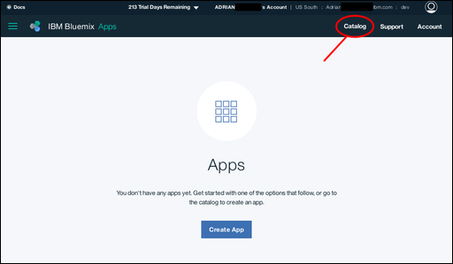<br/>
    This brings up a list of the services available on {{site.data.keyword.Bluemix_notm}}.

3.  Click the `Cloud Foundry Apps` entry under the `Apps` heading:<br/>
    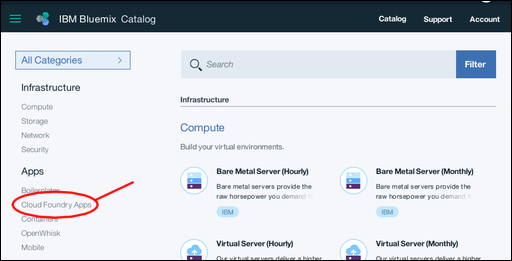<br/>
    This brings up a list of the Cloud Foundry Applications
    available on {{site.data.keyword.Bluemix_notm}}.

4.  Click the `Python` entry:<br/>
    <br/>
    This brings up a `Create a Cloud Foundry App` form that lets you
    specify and create the environment for a Python Cloud Foundry application.

5.  Enter a name for your application,
    for example `Cloudant Python`.
    The hostname is generated for you automatically,
    although you can customize it if you prefer:<br/>
    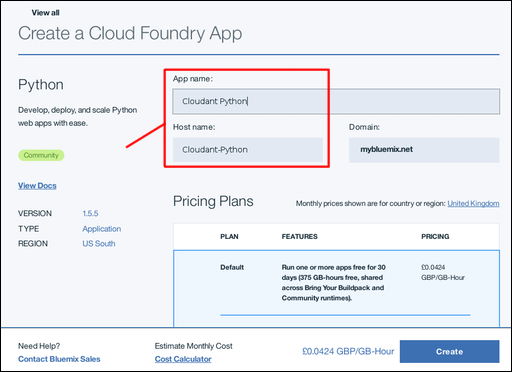<br/>
    >   **Note**: The hostname must be unique within the {{site.data.keyword.Bluemix_notm}} domain. In this example, the domain is `mybluemix.net`, giving a full hostname of `Cloudant-Python.mybluemix.net`.

6.  Click the `Create` button:<br/>
    

7.  After a short pause,
    the `Getting Started` panel for your new app is displayed.
    The newly created app is started automatically,
    as shown by the green icon and `Your app is running` status.
    At this stage,
    the app is little more than a 'heart beat' application,
    sufficient to show that the basic application environment is ready for you to work with.
    Click the `Dashboard` link to return to your {{site.data.keyword.Bluemix_notm}} account dashboard.<br/>
    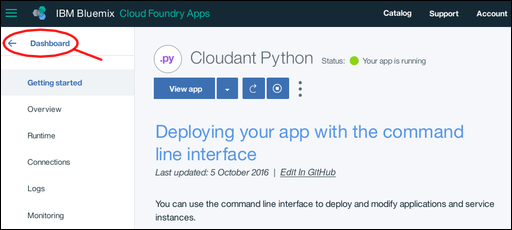

8.  You can now see your newly created application environment listed on the dashboard:<br/>
    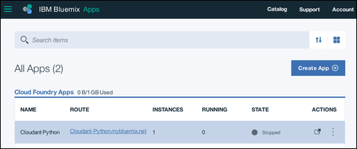

You now have a basic {{site.data.keyword.Bluemix_notm}} Python application environment,
ready to work with.

We want to work with a {{site.data.keyword.cloudant_short_notm}} database instance,
so the next step is to create a 'connection' between the application environment and the database instance.

<div id="connecting"></div>

## Connecting {{site.data.keyword.Bluemix_notm}} applications and services

This section of the tutorial explains how you connect
{{site.data.keyword.Bluemix_notm}} application environments and services.
This is done from within the configuration and management area of your application.

1.  From your {{site.data.keyword.Bluemix_notm}} dashboard,
    click the entry for your application.<br/>
    <br/>
    >   **Note**: Avoid the URL area, as clicking the link would try and launch the application rather than taking you to the configuration area. A safe place to click is on the name of your application.

    This takes you to the configuration and management overview area for your application.

2.  Click the `Connections` link:<br/>
    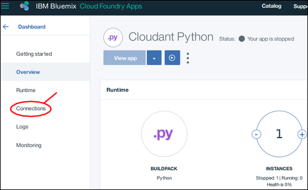<br/>
    This takes you to an area for configuring a connection between your application and any other services available within your account.

3.  A [pre-requisite](#pre-requisites) for this tutorial is that you should already have a {{site.data.keyword.cloudant_short_notm}} database instance.
    Click the `Connect existing` button to establish a connection between the database instance and your application:<br/>
    <br/>
    This takes you to a list of the existing service instances in your account.

4.  Click on the {{site.data.keyword.cloudant_short_notm}} database instance you want to use.
    In this tutorial,
    we are using the `Cloudant Service 2017` instance:<br/>
    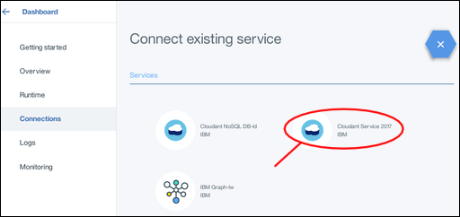

5.  You are asked to confirm that you really want to connect the database instance to your application.
    Click the `Connect` button to confirm the connection:<br>
    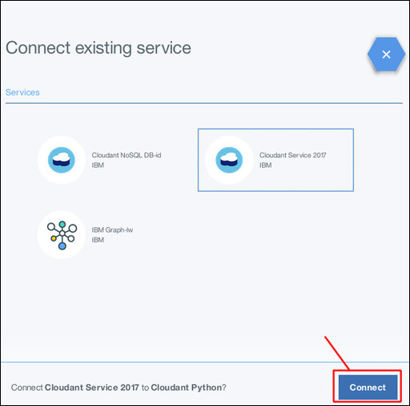

6.  Modifying the service connections for an application affects its overall configuration.
    This requires a 'restaging' of the application,
    which also forces a running application to stop.
    A pop-up window appears,
    asking you to confirm that you are ready for the 'restaging' to proceed.
    Click the `Restage` button to continue:<br/>
    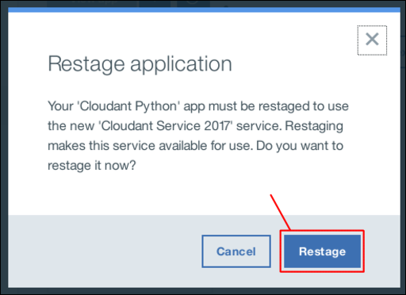

7.  The service connections page is re-displayed,
    and now includes the newly connected database instance:<br/>
    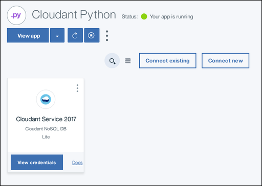

<div id="toolkits"></div>

## The Cloud Foundry and Bluemix command line toolkits

This section of the tutorial describes the toolkits you require to work with
your {{site.data.keyword.Bluemix_notm}} environment,
applications,
and services.

Downloading and installing the toolkits is a one-off task;
if you have the toolkits installed and working on your system,
you do not need to download them again,
unless they have been updated.

More information about the toolkits is available
[here](https://console.ng.bluemix.net/docs/cli/index.html){:new_window}.

### The Cloud Foundry toolkit

1.  A link to download the Cloud Foundry toolkit is available on the `Getting started` panel of
    your application:<br/>
    

2.  Clicking the link takes you to a
    [download page on Github](https://github.com/cloudfoundry/cli/releases){:new_window}:<br/>
    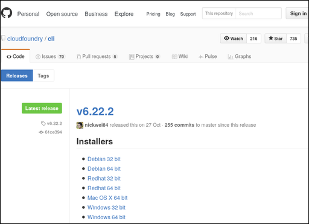


<div id="starter"></div>

## The 'starter' application

This section of the tutorial describes a {{site.data.keyword.Bluemix_notm}}
'starter' application,
and explains how you customize it to access
a {{site.data.keyword.cloudant_short_notm}} database instance.

<div id="creating"></div>

## Creating your application

This section of the tutorial explains how to create a Python
application that can access
the {{site.data.keyword.cloudant_short_notm}} database instance.

<div id="uploading"></div>

## Uploading your application and testing that it works

<div id="maintenance"></div>

## Performing basic application maintenance tasks

This section of the tutorial explains how to upload,
start,
and stop,
your Python applications on {{site.data.keyword.Bluemix_notm}}.

<div id="troubleshooting"></div>

## Diagnosing and resolving problems

This section of the tutorial provides some basic troubleshooting tips to help
you identify,
diagnose,
and resolve some problems you might encounter when developing and deploying
your first {{site.data.keyword.Bluemix_notm}} applications.


## Complete listing

The following code is a complete Python program to access a
{{site.data.keyword.cloudant_short_notm}} service instance on {{site.data.keyword.Bluemix_notm}},
and perform a typical series of tasks:
