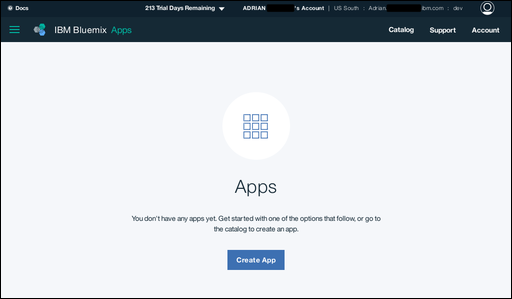
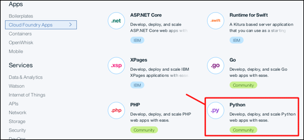
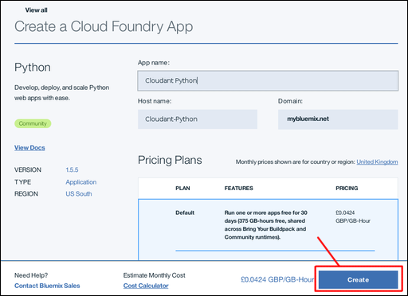
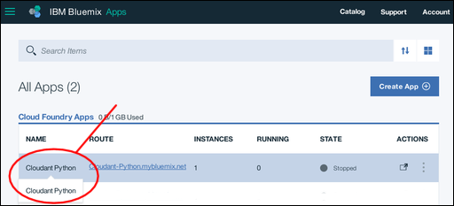
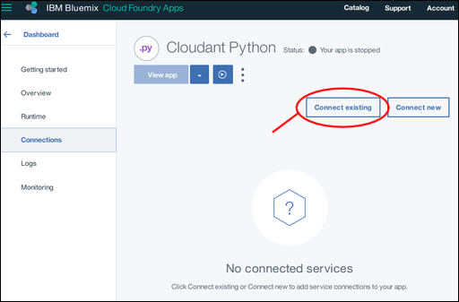
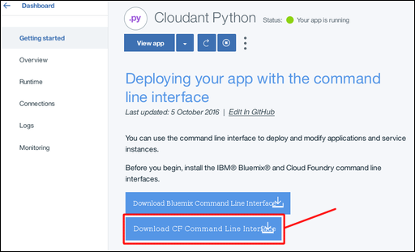
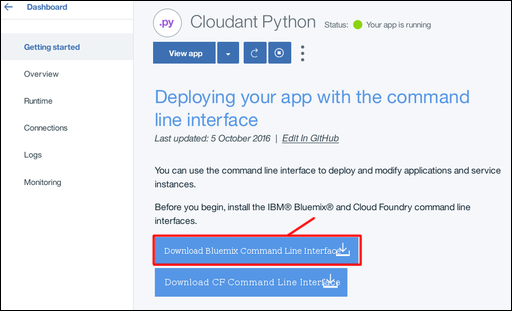
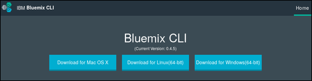

---

copyright:
  years: 2015, 2016
lastupdated: "2016-12-19"

---

{:new_window: target="_blank"}
{:shortdesc: .shortdesc}
{:screen: .screen}
{:codeblock: .codeblock}
{:pre: .pre}

# Creating a simple Bluemix application to access a Cloudant database

This tutorial shows you how to create an {{site.data.keyword.Bluemix}} application that uses the
[Python programming language](https://www.python.org/){:new_window} to
access an {{site.data.keyword.cloudantfull}} database,
hosted in your {{site.data.keyword.Bluemix_notm}} service instance.
{:shortdesc}

## Pre-requisites

Ensure that you have the following resources or information ready,
before you start working through the tutorial.

### Python

For all but the simplest possible development work,
it is much easier if you have a current installation of the
[Python programming language](https://www.python.org/){:new_window}
installed on your system.

To check this,
run the following command at a prompt:

```shell
python --version
```
{:pre}

You should get a result similar to:

```text
Python 2.7.12
```
{:codeblock}

<div id="csi"></div>

### A Cloudant service instance on Bluemix

A tutorial for creating a {{site.data.keyword.cloudant_short_notm}} service instance is available [here](create_service.html).

In this tutorial,
we assume that you have a service instance called
`Cloudant Service 2017`.

### A Cloudant database application

A tutorial for creating a standalone Python application to work with a {{site.data.keyword.cloudant_short_notm}}
service instance is available [here](create_database.html).
It introduces a number of concepts that are helpful for understanding how to create and populate a
{{site.data.keyword.cloudant_short_notm}} database.

This tutorial assumes you are familiar with those concepts.

## Context

A big advantage of {{site.data.keyword.Bluemix_notm}} is that you can create and deploy applications within
{{site.data.keyword.Bluemix_notm}} itself.
This means that you do not have to find and maintain a server to run your applications.

If you are already using a {{site.data.keyword.cloudant_short_notm}} database instance
within {{site.data.keyword.Bluemix_notm}},
it makes sense to have your applications there,
too.

{{site.data.keyword.Bluemix_notm}} applications are typically created using
[Cloud Foundry](https://en.wikipedia.org/wiki/Cloud_Foundry){:new_window} technology.
This is a Platform-as-a-Service (Paas) capability,
that simplifies the process of creating applications that can be deployed and run
within a Cloud environment.

[Another tutorial](create_database.html) showed you how to create a Python application
that uses a {{site.data.keyword.cloudant_short_notm}}
database instance within {{site.data.keyword.Bluemix_notm}}.
In this tutorial,
we show you how to set-up and create a simple Python application,
hosted within {{site.data.keyword.Bluemix_notm}}.
The application connects to your {{site.data.keyword.cloudant_short_notm}} database instance,
and creates a single,
simple document.

Python code specific to each task is provided as part of this tutorial.
A complete Python program,
sufficient to demonstrate the concepts working,
is provided at the end of the tutorial,
[here](#complete-listing).

No attempt has been made to create _efficient_ Python code for this tutorial;
the intention is to show simple and easy-to-understand working code
that you can learn from and apply for your own applications.

Also,
no attempt has been made to address all possible checks or error conditions.
Some example checks are shown here,
to illustrate the techniques,
but you should apply normal best practices for checking and handling all
warning or error conditions encountered by your own applications.

## Task overview

To create a working Python application on {{site.data.keyword.Bluemix_notm}},
that can access a {{site.data.keyword.cloudant_short_notm}} database instance,
you need to perform the following tasks:

1.  [Create a Python application enviroment on {{site.data.keyword.Bluemix_notm}}.](#creating)
2.  [Ensure that the Python application environment has a 'connection' to a {{site.data.keyword.cloudant_short_notm}} database instance.](#connecting)
3.  [(One-off task) Download and install the Cloud Foundry and Bluemix command line toolkits.](#toolkits)
4.  [Download the 'starter' application.](#starter)
5.  [Customize the starter application to create your own application for accessing the {{site.data.keyword.cloudant_short_notm}} database instance.](#theApp)
6.  [Upload your application and test that it works.](#uploading)
7.  [Perform basic application maintenance tasks.](#maintenance)
8.  [Diagnose and resolve problems (troubleshooting).](#troubleshooting)

<div id="creating"></div>

## Creating a {{site.data.keyword.Bluemix_notm}} application environment

1.  Login to your {{site.data.keyword.Bluemix_notm}} account.<br/>
    The {{site.data.keyword.Bluemix_notm}} dashboard can be found at:
    [http://bluemix.net](http://bluemix.net){:new_window}.
    After you have successfully authenticated by entering your username and password,
    you are presented with the {{site.data.keyword.Bluemix_notm}} dashboard:<br/>
    

2.  Click the `Catalog` link:<br/>
    <br/>
    This brings up a list of the services available on {{site.data.keyword.Bluemix_notm}}.

3.  Click the `Cloud Foundry Apps` entry under the `Apps` heading:<br/>
    <br/>
    This brings up a list of the Cloud Foundry Applications
    available on {{site.data.keyword.Bluemix_notm}}.

4.  Click the `Python` entry:<br/>
    <br/>
    This brings up a `Create a Cloud Foundry App` form that lets you
    specify and create the environment for a Python Cloud Foundry application.

5.  Enter a name for your application,
    for example `Cloudant Python`.
    The hostname is generated for you automatically,
    although you can customize it if you prefer:<br/>
    <br/>
    >   **Note**: The hostname must be unique within the {{site.data.keyword.Bluemix_notm}} domain. In this example, the domain is `mybluemix.net`, giving a full hostname of `Cloudant-Python.mybluemix.net`.

6.  Click the `Create` button:<br/>
    

7.  After a short pause,
    the `Getting Started` panel for your new app is displayed.
    The newly created app is started automatically,
    as shown by the green icon and `Your app is running` status.
    At this stage,
    the app is little more than a 'heart beat' application,
    sufficient to show that the basic application environment is ready for you to work with.
    Click the `Dashboard` link to return to your {{site.data.keyword.Bluemix_notm}} account dashboard.<br/>
    

8.  You can now see your newly created application environment listed on the dashboard:<br/>
    

You now have a basic {{site.data.keyword.Bluemix_notm}} Python application environment,
ready to work with.

We want to work with a {{site.data.keyword.cloudant_short_notm}} database instance,
so the next step is to create a 'connection' between the application environment and the database instance.

<div id="connecting"></div>

## Connecting {{site.data.keyword.Bluemix_notm}} applications and services

This section of the tutorial explains how you connect
{{site.data.keyword.Bluemix_notm}} application environments and services.
This is done from within the configuration and management area of your application.

1.  From your {{site.data.keyword.Bluemix_notm}} dashboard,
    click the entry for your application.<br/>
    <br/>
    >   **Note**: Avoid the URL area, as clicking the link would try and launch the application rather than taking you to the configuration area. A safe place to click is on the name of your application.

    This takes you to the configuration and management overview area for your application.

2.  Click the `Connections` link:<br/>
    <br/>
    This takes you to an area for configuring a connection between your application and any other services available within your account.

3.  A [pre-requisite](#pre-requisites) for this tutorial is that you should already have a {{site.data.keyword.cloudant_short_notm}} database instance.
    Click the `Connect existing` button to establish a connection between that database instance and your application:<br/>
    <br/>
    This takes you to a list of the existing service instances in your account.

4.  Click on the {{site.data.keyword.cloudant_short_notm}} database instance you want to use.
    In this tutorial,
    we are using the `Cloudant Service 2017` instance:<br/>
    

5.  You are asked to confirm that you really want to connect the database instance to your application.
    Click the `Connect` button to confirm the connection:<br>
    

6.  Modifying the service connections for an application affects its overall configuration.
    This requires a 'restaging' of the application,
    which also forces a running application to stop.
    A pop-up window appears,
    asking you to confirm that you are ready for the 'restaging' to proceed.
    Click the `Restage` button to continue:<br/>
    

7.  The service connections page is re-displayed,
    and now includes the newly connected database instance:<br/>
    

We have now connected the application environment and the database instance.
The next step is to ensure we have the necessary tools to let us
work with {{site.data.keyword.Bluemix_notm}} applications.

<div id="toolkits"></div>

## The Cloud Foundry and Bluemix command line toolkits

This section of the tutorial describes the toolkits you must have installed to work with
your {{site.data.keyword.Bluemix_notm}} environment,
applications,
and services.

The [Cloud Foundry](https://en.wikipedia.org/wiki/Cloud_Foundry){:new_window}
toolkit is a collection of tools for working with applications
deployed in a Cloud Foundry-compatible environment.
The tools enable you to perform tasks such as updating a deployed application,
and start or stop a running application.

The {{site.data.keyword.Bluemix_notm}} toolkit provides additional capabilities,
required for working with applications hosted and running within a {{site.data.keyword.Bluemix_notm}} environment.

Downloading and installing the toolkits is a one-off task;
if you already have the toolkits installed and working on your system,
you do not need to download them again,
unless they have been updated.

General information about the toolkits is available
[here](https://console.ng.bluemix.net/docs/cli/index.html){:new_window}.

### Installing the Cloud Foundry toolkit

Some operating system distributions have a version of the Cloud Foundry toolkit available already.
If the version supported is 6.11 or better,
this is compatible with {{site.data.keyword.Bluemix_notm}} and can be used.
You can check what version you have installed by running the test described [here](#checkCFversion).

Alternatively,
use the following steps to download and install the Cloud Foundry toolkit on your system: 

1.  A link to download the Cloud Foundry toolkit is available on the `Getting started` panel of
    your application:<br/>
    

2.  Clicking the link takes you to a
    [download page on Github](https://github.com/cloudfoundry/cli/releases){:new_window}:<br/>
    

3.  Download and run the appropriate installer for your platform.

4.  <div id='checkCFversion'></div>To check that you have a working Cloud Foundry toolkit,
    run the following command at a prompt:

    ```shell
    cf --version
    ```
    {:pre}
    
    You should get a result similar to:
    
    ```text
    cf version 6.20.0+25b1961-2016-06-29
    ```
    {:codeblock}
    
    >   **Note**: The version must be 6.11 or more recent to be compatible with {{site.data.keyword.Bluemix_notm}}.

### Installing the Bluemix toolkit

Use the following steps to download and install the {{site.data.keyword.Bluemix_notm}} toolkit on your system: 

1.  A link to download the {{site.data.keyword.Bluemix_notm}} toolkit is available
    on the `Getting started` panel of your application:<br/>
    

2.  Clicking the link takes you to a
    [download page](http://clis.ng.bluemix.net/ui/home.html){:new_window}:<br/>
    

3.  Download and run the appropriate installer for your platform.

    The installer checks to ensure that you have a suitable version of the Cloud Foundry toolkit installed.
    If everything appears to be correct,
    the {{site.data.keyword.Bluemix_notm}} toolkit is installed on your system.

4.  To check that you have a working {{site.data.keyword.Bluemix_notm}} toolkit,
    run the following command at a prompt:
    
    ```shell
    bluemix --version
    ```
    {:pre}
    
    You should get a result similar to:
    
    ```text
    bluemix version 0.4.5+03c29de-2016-12-08T07:01:01+00:00
    ```
    {:codeblock}
    
We now have the necessary tools to let us
work with {{site.data.keyword.Bluemix_notm}} applications.
The next step is to obtain the 'starter' materials to help us create
a {{site.data.keyword.Bluemix_notm}} application.

<div id="starter"></div>

## The 'starter' application

This section of the tutorial describes a {{site.data.keyword.Bluemix_notm}}
'starter' application,
and explains how you customize it to access
a {{site.data.keyword.cloudant_short_notm}} database instance.

A {{site.data.keyword.Bluemix_notm}} starter application is the minimum possible collection
of source and configuration files,
necessary to create a {{site.data.keyword.Bluemix_notm}} application.
In some regards,
it is similar to a 'Hello World' application;
sufficient to show that the basic system and configuration is working correctly.

A {{site.data.keyword.Bluemix_notm}} starter application is an archive containing files
you must modify or extend as you develop your {{site.data.keyword.Bluemix_notm}} application.

Three files in particular are essential:

-   [`Procfile`](#procfile)
-   [`manifest.yml`](#manifest)
-   [`requirements.txt`](#requirements)

<div id="procfile"></div>

### The `Procfile` file

The `Procfile` is the most important file,
describing what {{site.data.keyword.Bluemix_notm}} should do to run your application.

More specifically,
a `Procfile` is a Cloud Foundry artefact that
defines an application process type and the command line that launches the application.
More information about `Procfile` is available
[here](https://docs.cloudfoundry.org/buildpacks/prod-server.html#procfile){:new_window}

The `Procfile` for a {{site.data.keyword.Bluemix_notm}} Python starter application looks similar to the following:

```text
web: python server.py
```
{:codeblock}

This indicates that the application is a Python web application,
and that it is started by running the command:

```shell
python server.py
```
{:codeblock}

A 'starter' `server.py` Python source file is included in the starter application archive.
The `server.py` file is modified for your application.
Alternatively,
create an entirely new Python source file,
and update the `Procfile` accordingly so that the new file is used when your application launches.

<div id="manifest"></div>

### The `manifest.yml` file

The `manifest.yml` file is a full description of the application and the environment it requires to run.

The file for a {{site.data.keyword.Bluemix_notm}} Python starter application looks similar to the following:

```text
applications:
- path: .
  memory: 128M
  instances: 1
  domain: mybluemix.net
  name: Cloudant Python
  host: Cloudant-Python
  disk_quota: 1024M
  services:
  - Cloudant Service 2017
```
{:codeblock}

Three points are worth noting:

-   The `domain`,
    `name`,
    and `host` values correspond to those you entered when
    your {{site.data.keyword.Bluemix_notm}} application was [created](#creating).
-   The `name` value is used by the Cloud Foundry toolkit to identify the application you are administering.
-   The `services` value confirms that the `Cloudant Service 2017`
    {{site.data.keyword.cloudant_short_notm}} database instance is connected to the application environment.

You do not normally need to modify this file,
however it is helpful to understand why it must be present for your application to work.

<div id="requirements"></div>

### The `requirements.txt` file

The `requirements.txt` file enables you to specify any components that are required for your application to work.

In the starter application,
the file is empty.

However,
in this tutorial we are creating a Python application that accesses a
{{site.data.keyword.cloudant_short_notm}} database instance.
Therefore,
the application must be able to use the
[{{site.data.keyword.cloudant_short_notm}} client library for Python applications](../libraries/supported.html#python).

1.  To enable the Python client library,
    modify the `requirements.txt` file to read:
    ```text
    cloudant==2.3.1
    ```
    {:codeblock}

<div id="theApp"></div>

## Creating your application

This section of the tutorial explains how to create a Python
application within {{site.data.keyword.Bluemix_notm}} that can access
the {{site.data.keyword.cloudant_short_notm}} database instance.

We have the following essential components in place,
ready to begin creating our application:

-   [The Python programming language](#python).
-   [A {{site.data.keyword.cloudant_short_notm}} database instance](#csi).
-   [A {{site.data.keyword.Bluemix_notm}} application environment](#creating).
-   A [connection](#connecting) between the {{site.data.keyword.cloudant_short_notm}} database instance
    and the {{site.data.keyword.Bluemix_notm}} application environment.
-   The [toolkits](#toolkits) for managing Cloud Foundry-based {{site.data.keyword.Bluemix_notm}} applications.
-   A ['starter' application pack](#starter), containing initial configuration and code template files.

### Essential files

Your application requires three configuration files and one source file,
all available in the ['starter' application pack](#starter):
 
1.  [`Procfile`](#procfile)
2.  [`manifest.yml`](#manifest)
3.  [`requirements.txt`](#requirements)
4.  The application source file, described in this section of the tutorial.

Modify your configuration files as follows:

1.  Edit the `Procfile` file so that it contains the following text:
    ```text
    web: python server.py
    ```
    {:codeblock}

2.  Edit the `manifest.yml` file so that it contains the following text:
    ```text
    applications:
    - path: .
      memory: 128M
      instances: 1
      domain: <your domain>
      name: <your application name>
      host: <your application host>
      disk_quota: 1024M
      services:
      - <your database instance>
    ```
    {:codeblock}
    
>   **Note**: Ensure that you modify the `domain`, `name`, `host`,
and `services` values according to the values you chose when creating your
[{{site.data.keyword.Bluemix_notm}} application environment](#creating) and
your [{{site.data.keyword.cloudant_short_notm}} database instance](#csi).

3.  Edit the `requirements.txt` file so that it contains the following text:
    ```text
    cloudant==2.3.1
    ```
    {:codeblock}

### The application code

We can now work on the application code.

<div id="uploading"></div>

## Uploading your application and testing that it works

```
./bluemix api https://api.ng.bluemix.net
Invoking 'cf api https://api.ng.bluemix.net'...

Setting api endpoint to https://api.ng.bluemix.net...
OK

API endpoint:   https://api.ng.bluemix.net
API version:    2.54.0
Not logged in. Use './bluemix login' to log in.
```

```
./bluemix login -u Adrian.Warman@uk.ibm.com -o Adrian.Warman@uk.ibm.com -s dev
Invoking 'cf login -u Adrian.Warman@uk.ibm.com -o Adrian.Warman@uk.ibm.com -s dev'...

API endpoint: https://api.ng.bluemix.net

Password> 
Authenticating...
OK

Targeted org Adrian.Warman@uk.ibm.com

Targeted space dev


                
API endpoint:   https://api.ng.bluemix.net (API version: 2.54.0)
User:           adrian.warman@uk.ibm.com
Org:            Adrian.Warman@uk.ibm.com
Space:          dev
[warmana@localhost bin]$ 

```

```
[warmana@localhost BMXDemo]$ cf push "Cloudant Python"
Using manifest file /home/warmana/00host/Archive/Data/Customers/CDS/github/github.com/warmana/bluemixcode/BMXDemo/manifest.yml

Updating app Cloudant Python in org Adrian.Warman@uk.ibm.com / space dev as Adrian.Warman@uk.ibm.com...
OK

Using route Cloudant-Python.mybluemix.net
Uploading Cloudant Python...
Uploading app files from: /home/warmana/00host/Archive/Data/Customers/CDS/github/github.com/warmana/bluemixcode/BMXDemo
Uploading 1.5K, 3 files
Done uploading               
OK
Binding service Cloudant Service 2017 to app Cloudant Python in org Adrian.Warman@uk.ibm.com / space dev as Adrian.Warman@uk.ibm.com...
OK

Starting app Cloudant Python in org Adrian.Warman@uk.ibm.com / space dev as Adrian.Warman@uk.ibm.com...
-----> Downloaded app package (4.0K)
-----> Downloaded app buildpack cache (29M)
-------> Buildpack version 1.5.5
     $ pip install -r requirements.txt
DEPRECATION: --allow-all-external has been deprecated and will be removed in the future. Due to changes in the repository protocol, it no longer has any effect.
       Collecting cloudant==2.3.1 (from -r requirements.txt (line 1))
         Downloading cloudant-2.3.1-py2-none-any.whl (63kB)
       Collecting requests<3.0.0,>=2.7.0 (from cloudant==2.3.1->-r requirements.txt (line 1))
         Downloading requests-2.12.4-py2.py3-none-any.whl (576kB)
       Installing collected packages: requests, cloudant
       Successfully installed cloudant-2.3.1 requests-2.12.4
You are using pip version 8.1.1, however version 9.0.1 is available.
You should consider upgrading via the 'pip install --upgrade pip' command.
You are using pip version 8.1.1, however version 9.0.1 is available.
You should consider upgrading via the 'pip install --upgrade pip' command.
-----> Uploading droplet (30M)

0 of 1 instances running, 1 starting
1 of 1 instances running

App started


OK

App Cloudant Python was started using this command `python server.py`

Showing health and status for app Cloudant Python in org Adrian.Warman@uk.ibm.com / space dev as Adrian.Warman@uk.ibm.com...
OK

requested state: started
instances: 1/1
usage: 128M x 1 instances
urls: Cloudant-Python.mybluemix.net
last uploaded: Thu Dec 22 15:58:18 UTC 2016
stack: cflinuxfs2
buildpack: python 1.5.5

     state     since                    cpu    memory          disk           details
#0   running   2016-12-22 03:59:21 PM   0.0%   49.9M of 128M   110.6M of 1G
[warmana@localhost BMXDemo]
```

```

```


<div id="maintenance"></div>

## Performing basic application maintenance tasks

This section of the tutorial explains how to upload,
start,
and stop,
your Python applications on {{site.data.keyword.Bluemix_notm}}.

<div id="troubleshooting"></div>

## Diagnosing and resolving problems

This section of the tutorial provides some basic troubleshooting tips to help
you identify,
diagnose,
and resolve some problems you might encounter when developing and deploying
your first {{site.data.keyword.Bluemix_notm}} applications.

A good source of advice on best practice for creating {{site.data.keyword.Bluemix_notm}} or
Cloud Foundry applications is
[here](https://docs.cloudfoundry.org/devguide/deploy-apps/prepare-to-deploy.html){:new_window}.

In particular,
the advice on
[avoiding writes to the local file system](https://docs.cloudfoundry.org/devguide/deploy-apps/prepare-to-deploy.html#filesystem){:new_window}
is prudent.

>   **Note**: For reasons of simplicity,
    this tutorial does write content to the local file system,
    however,
    the quantity of material is very small,
    it is not expected to persist,
    and it is not 'mission critical'.

## Complete listing

The following code is a complete Python program to access a
{{site.data.keyword.cloudant_short_notm}} service instance on {{site.data.keyword.Bluemix_notm}},
and perform a typical series of tasks:
