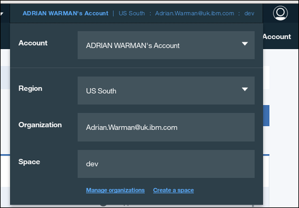

---

copyright:
  years: 2015, 2017
lastupdated: "2017-01-05"

---

{:new_window: target="_blank"}
{:shortdesc: .shortdesc}
{:screen: .screen}
{:codeblock: .codeblock}
{:pre: .pre}

# Creating a simple Bluemix application to access a Cloudant database: uploading the application

This section of the tutorial describes how to upload a
{{site.data.keyword.Bluemix}} application.
{:shortdesc}

<div id="uploading"></div>

## Connecting to Bluemix

The first task is to connect to {{site.data.keyword.Bluemix_notm}}.

The [{{site.data.keyword.Bluemix_notm}} toolkit](create_bmxapp_appenv.html#toolkits) helps you to make the connection.

Cloud Foundry needs to know the URL to use for making API calls,
for example when uploading an application.
The {{site.data.keyword.Bluemix_notm}} toolkit uses the `cf api` command to manage the API endpoint.
More information about the `cf api` command is
[available](https://console.ng.bluemix.net/docs/cli/reference/cfcommands/index.html#cf_api){:new_window}.

Use the following command to tell Cloud Foundry the URL to use:

```shell
bluemix api https://api.ng.bluemix.net
```
{:pre}

Expect a result similar to the following output:

```text
Invoking 'cf api https://api.ng.bluemix.net'...

Setting api endpoint to https://api.ng.bluemix.net...
OK

API endpoint:   https://api.ng.bluemix.net
API version:    2.54.0
Not logged in. Use 'bluemix login' to log in.
```
{:codeblock}

Cloud Foundry now knows where to send API calls for managing applications.

The next step is to log in to your {{site.data.keyword.Bluemix_notm}} application environment.
You must supply the following account details:

-   Your user name, specified as the `-u` parameter.
-   Your organization name, specified as the `-o` parameter.
-   Your space, specified as the `-s` parameter.

>   **Note**: The account details are available on your {{site.data.keyword.Bluemix_notm}} dashboard,
    when you log in through a web browser,
    as shown in the following example:<br/>
    

Use a command similar to the following example to log in to your
{{site.data.keyword.Bluemix_notm}} application environment.
You are asked to enter your account password:

```shell
bluemix login -u Adrian.Warman@uk.ibm.com -o Adrian.Warman@uk.ibm.com -s dev
```
{:pre}

Expect a result similar to the following output:

```text
Invoking 'cf login -u Adrian.Warman@uk.ibm.com -o Adrian.Warman@uk.ibm.com -s dev'...

API endpoint: https://api.ng.bluemix.net

Password> 
Authenticating...
OK

Targeted org Adrian.Warman@uk.ibm.com

Targeted space dev


                
API endpoint:   https://api.ng.bluemix.net (API version: 2.54.0)
User:           adrian.warman@uk.ibm.com
Org:            Adrian.Warman@uk.ibm.com
Space:          dev
```
{:codeblock}

```
[warmana@localhost BMXDemo]$ cf push "Cloudant Python"
Using manifest file /home/warmana/00host/Archive/Data/Customers/CDS/github/github.com/warmana/bluemixcode/BMXDemo/manifest.yml

Updating app Cloudant Python in org Adrian.Warman@uk.ibm.com / space dev as Adrian.Warman@uk.ibm.com...
OK

Using route Cloudant-Python.mybluemix.net
Uploading Cloudant Python...
Uploading app files from: /home/warmana/00host/Archive/Data/Customers/CDS/github/github.com/warmana/bluemixcode/BMXDemo
Uploading 1.5K, 3 files
Done uploading               
OK
Binding service Cloudant Service 2017 to app Cloudant Python in org Adrian.Warman@uk.ibm.com / space dev as Adrian.Warman@uk.ibm.com...
OK

Starting app Cloudant Python in org Adrian.Warman@uk.ibm.com / space dev as Adrian.Warman@uk.ibm.com...
-----> Downloaded app package (4.0K)
-----> Downloaded app buildpack cache (29M)
-------> Buildpack version 1.5.5
     $ pip install -r requirements.txt
DEPRECATION: --allow-all-external has been deprecated and will be removed in the future. Due to changes in the repository protocol, it no longer has any effect.
       Collecting cloudant==2.3.1 (from -r requirements.txt (line 1))
         Downloading cloudant-2.3.1-py2-none-any.whl (63kB)
       Collecting requests<3.0.0,>=2.7.0 (from cloudant==2.3.1->-r requirements.txt (line 1))
         Downloading requests-2.12.4-py2.py3-none-any.whl (576kB)
       Installing collected packages: requests, cloudant
       Successfully installed cloudant-2.3.1 requests-2.12.4
You are using pip version 8.1.1, however version 9.0.1 is available.
You should consider upgrading via the 'pip install --upgrade pip' command.
You are using pip version 8.1.1, however version 9.0.1 is available.
You should consider upgrading via the 'pip install --upgrade pip' command.
-----> Uploading droplet (30M)

0 of 1 instances running, 1 starting
1 of 1 instances running

App started


OK

App Cloudant Python was started using this command `python server.py`

Showing health and status for app Cloudant Python in org Adrian.Warman@uk.ibm.com / space dev as Adrian.Warman@uk.ibm.com...
OK

requested state: started
instances: 1/1
usage: 128M x 1 instances
urls: Cloudant-Python.mybluemix.net
last uploaded: Thu Dec 22 15:58:18 UTC 2016
stack: cflinuxfs2
buildpack: python 1.5.5

     state     since                    cpu    memory          disk           details
#0   running   2016-12-22 03:59:21 PM   0.0%   49.9M of 128M   110.6M of 1G
[warmana@localhost BMXDemo]
```

```

```


<div id="maintenance"></div>

## Performing basic application maintenance tasks

This section of the tutorial explains how to upload,
start,
and stop,
your Python applications on {{site.data.keyword.Bluemix_notm}}.

<div id="troubleshooting"></div>

## Diagnosing and resolving problems

This section of the tutorial provides some basic troubleshooting tips to help
you identify,
diagnose,
and resolve some problems you might encounter when developing and deploying
your first {{site.data.keyword.Bluemix_notm}} applications.

A good source of advice on best practice for creating {{site.data.keyword.Bluemix_notm}} or
Cloud Foundry applications is
[here](https://docs.cloudfoundry.org/devguide/deploy-apps/prepare-to-deploy.html){:new_window}.

In particular,
the advice on
[avoiding writes to the local file system](https://docs.cloudfoundry.org/devguide/deploy-apps/prepare-to-deploy.html#filesystem){:new_window}
is prudent.

>   **Note**: For reasons of simplicity,
    this tutorial does write content to the local file system,
    however,
    the quantity of material is very small,
    it is not expected to persist,
    and it is not 'mission critical'.

